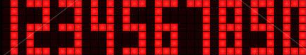

# Challenge #18: 🔢 The digital clock

In the toy factory, <span style="color:yellow">**the elves are programming a digital clock**</span> to keep them on schedule with gift production. However, they have encountered an interesting programming challenge. They need a function that, given a time in 'HH:MM' format, creates a visual representation of this time on a digital clock by returning <span style="color:yellow">**an array of arrays of characters**</span>.

<span style="color:yellow">**The clock screen has 7 rows and 17 columns**</span>, and each digit of the time takes up 7 rows and 3 columns. The digits are composed of asterisks (*) and blank spaces (). There is an empty column between each digit.

<span style="color:yellow">**The colon separating hours and minutes**</span> is drawn using two asterisks (*) and is always placed in the same position, in rows 2 and 4, in column 9, respectively (note: row and column indexing starts at 0).

For example, if the function receives ``01:30``, it should return:

```JavaScript
drawClock('01:30') // ⬇️

[
  ['*', '*', '*', ' ', ' ', ' ', '*', ' ', ' ', ' ', '*', '*', '*', ' ', '*', '*', '*'],
  ['*', ' ', '*', ' ', ' ', ' ', '*', ' ', ' ', ' ', ' ', ' ', '*', ' ', '*', ' ', '*'],
  ['*', ' ', '*', ' ', ' ', ' ', '*', ' ', '*', ' ', ' ', ' ', '*', ' ', '*', ' ', '*'],
  ['*', ' ', '*', ' ', ' ', ' ', '*', ' ', ' ', ' ', '*', '*', '*', ' ', '*', ' ', '*'],
  ['*', ' ', '*', ' ', ' ', ' ', '*', ' ', '*', ' ', ' ', ' ', '*', ' ', '*', ' ', '*'],
  ['*', ' ', '*', ' ', ' ', ' ', '*', ' ', ' ', ' ', ' ', ' ', '*', ' ', '*', ' ', '*'],
  ['*', '*', '*', ' ', ' ', ' ', '*', ' ', ' ', ' ', '*', '*', '*', ' ', '*', '*', '*']
]
```

To know how to draw each digit, we have been given the following image. As you can see, <span style="color:yellow">**each digit is composed of 7 rows and 3 columns**</span>. We will represent the pixels in red with an asterisk (*), and the white pixels with a space ():


